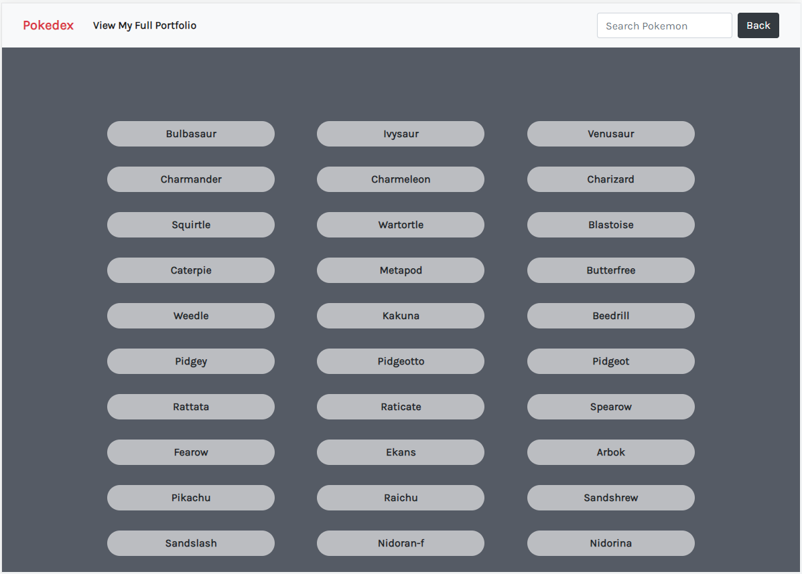
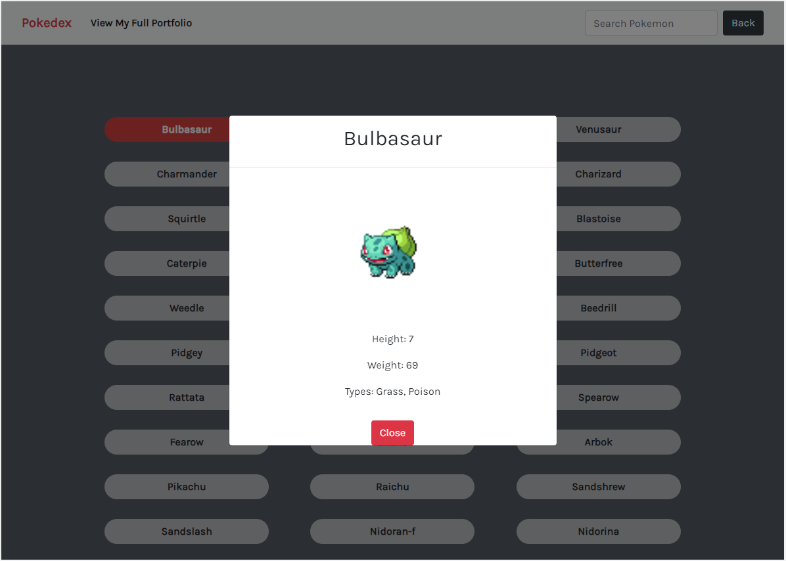

# Pokedex App

## Description
This is a fully functioning JavaScript web app built with HTML and CSS. Its main function is to fetch data from on external data source called [PokeAPI](https://pokeapi.co/) and enable the viewing of each Pokemon in detail.

## User Goals
Users should be able to view a list of Pokemon names and see more details for a given Pokemon on demand, as well as search for a name.

## Key Features
- Load data from an external source (API)
- View a list of items
- On user action (e.g., by clicking on a list item), view details for that item

## Link
[Pokedex Website](https://gracesuhyun.github.io/pokedex)
